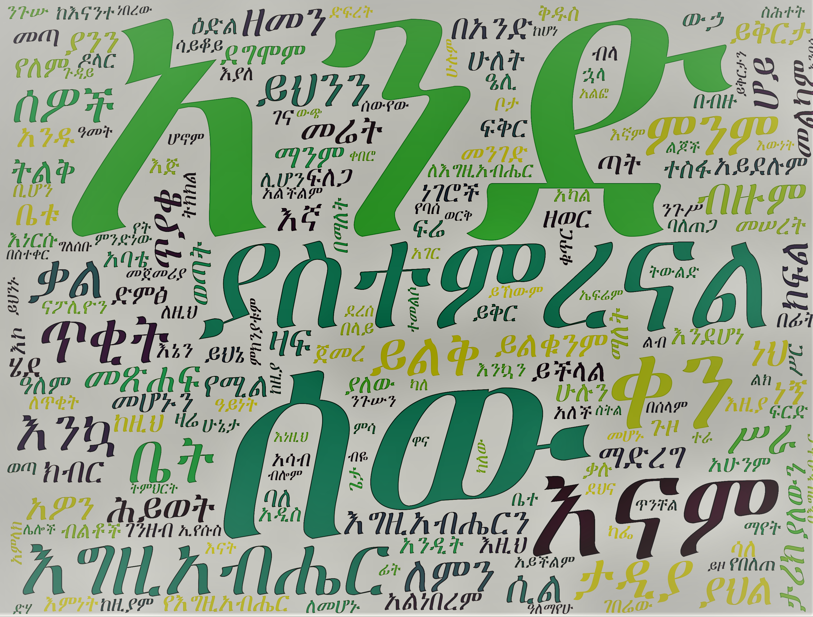

# Amharic wordcloud

Generate [Amharic](https://en.wikipedia.org/wiki/Amharic) word clouds using python

[word cloud](https://en.wikipedia.org/wiki/Tag_cloud) is a graphic representation of most frequent words in a text, ordered according to their visual impact.

based on: 
[tika](https://github.com/chrismattmann/tika-python) - to extract text from PDFs  
[Selenium](https://github.com/SeleniumHQ/selenium) and [webdriver_manager](https://github.com/SergeyPirogov/webdriver_manager) - to scrap comments YouTube  
[wordcloud](https://github.com/amueller/word_cloud) - to generate the word cloud

Example:

<!--  -->
የገበታ ወጎች a free ebook from http://www.alemayehu.org/

  